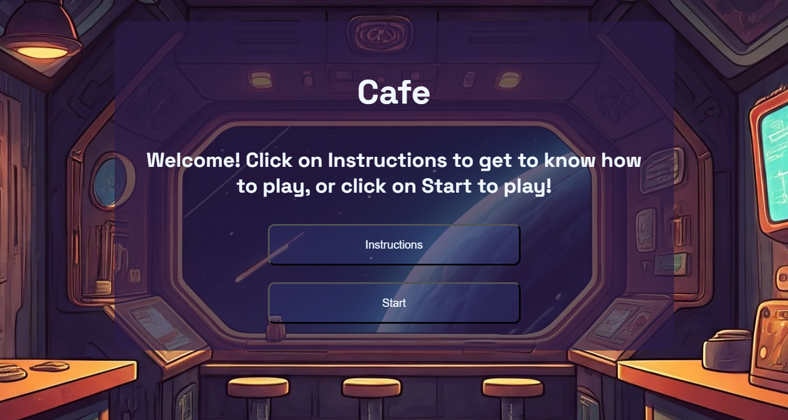
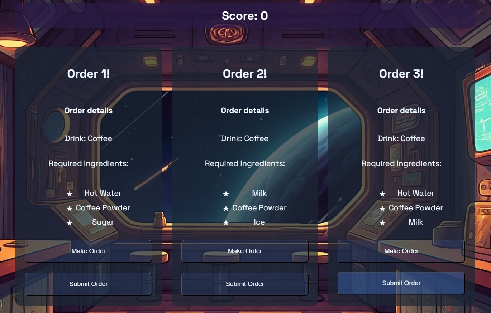

# Cafe App Game

# Tech Stack: React, AWS Cognito

# Demo Video

# How to Run in Visual Studio Code
1. Download all the files from Github
2. Open Visual Studio Code -> Open Cafe-App Folder 
3. Open Terminal (Near topleft, three dots -> Terminal -> New Terminal)
4. Type [cd "Pathway"] and enter without brackets
5. Type and enter [npm run dev] without brackets

# Screenshots of the App!

